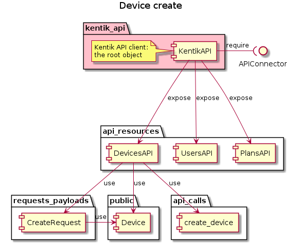
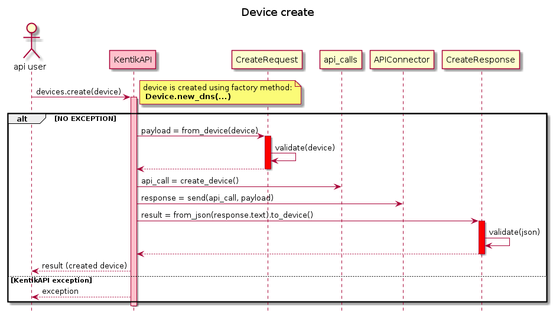
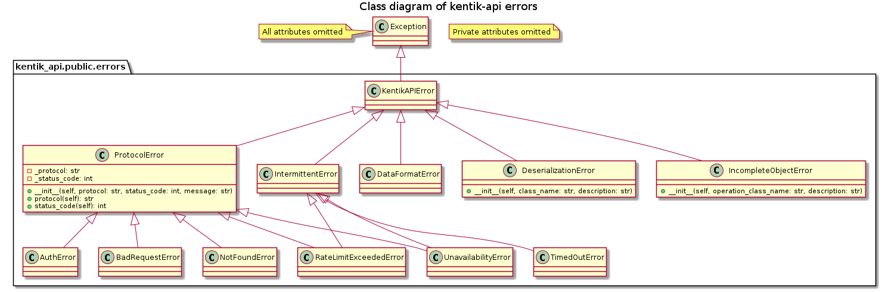

# community_sdk_python - developer

## Getting started

Precondition: python3 and pip3 are already installed.

### Recommended steps

1. Install virtualenv - this allows you to create a python sandbox for your project  
`pip3 install virtualenv`

1. Create dedicated virtual environment  
`virtualenv .venv`

1. Activate virtualenv  
`source .venv/bin/activate`

1. Clone the library repo  
`git clone https://github.com/kentik/community_sdk_python.git`

1. `cd community_sdk_python/`

1. Install the library from repo  
`pip3 install -e kentik_api_library/`

1. Run unit tests  
`pytest kentik_api_library/tests/unit/ kentik_api_library/tests/integration/`

1. Run mypy  
`mypy kentik_api_library/kentik_api kentik_api_library/tests/ kentik_api_library/examples/`

1. Run black check  
`black --fast --line-length 120 --check kentik_api_library`

## Example

The example below illustrates how to create a new device using the library:

```python
# library-specific imports
from kentik_api import (
    KentikAPI,
    Device,
    DeviceSubtype,
    CDNAttribute,
    ID,
)

# initialize Kentik API client
api_client = KentikAPI("<API_EMAIL_STRING>", "<API_TOKEN_STRING>")

# prepare device object
device = Device.new_dns(
    device_name="example-device-1",
    device_subtype=DeviceSubtype.aws_subnet,
    cdn_attr=CDNAttribute.yes,
    device_sample_rate=100,
    plan_id=ID(11466),
    site_id=ID(8483),
    device_bgp_flowspec=True,
)

# create the device
created = api_client.devices.create(device)

# print returned device's attributes
print(created.__dict__)
```

## Example explained

### Structure

- `kentik_api` package is the root package of the library
- `api_resources` package contains implementations of all the KentikAPI resource manipulation classes
- `public` package contains classes representing all KentikAPI resources
- `request_payloads` package contains serialization/deserialization structures for each KentikAPI resource
- `api_calls` package contains definitions of all requests that enable interaction with each KentikAPI resource

Main components taking part in creating a device:  


### Behaviour

A sequence of interactions that leads to creating a new device:  


## Error handling

For error handling there is an exception hierarchy that allows to handle:
- validation errors - when library user tries to create an incomplete/invalid resource
- deserialization erors - when invalid or incomplete resource json representation is received from KentikAPI
- protocol errors - errors covering selected HTTP error codes, in particular:
  - `IntermittentError` - request can be reattempted and succeed after a delay
  - `RateLimitExceededError` - effect of throttling on KentikAPI side


